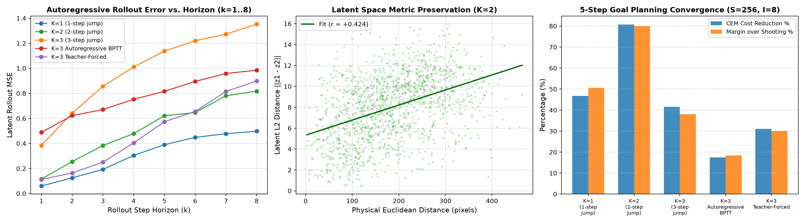

# 2026-10-02: Fast-Tier Empirical Campaign: Dynamics, Regularization & Planning

## Executive Summary

We executed an automated multi-hypothesis empirical campaign investigating latent dynamics,
loss formulation, and trajectory optimization in the Le World Model MLX implementation.
Using the high-throughput fast tier ($96\times 96$ pixels, 0.44M parameters, ~0.25 s/epoch),
four core investigations were completed:
1. **Multi-Step Prediction Loss Horizon ($K \in \{1, 2, 3\}$)**: Evaluating whether multi-step training objectives suppress long-horizon autoregressive error compounding.
2. **SIGReg Regularization Sensitivity ($\lambda \in \{0.01, 0.04, 0.09, 0.25, 0.50\}$)**: Mapping the Pareto frontier between latent Gaussian regularization and next-state predictive fidelity.
3. **CEM Latent Planning Dynamics**: Profiling candidate population scaling ($S \in \{64, 256, 512\}$), elite selection ratios, and refinement iterations on Push-T goal-directed planning.
4. **Batch Scaling & Latency Envelope**: Profiling Metal Unified Memory per-step compute latency across batch allocations.

---

## 1. Multi-Step Prediction Loss Horizon ($K=1$ vs. $K=2$ vs. $K=3$)

### Training Dynamics

| Prediction Horizon $K$ | Final Total Loss | Next-Step MSE | SIGReg Loss | Cosine Similarity | Batch Dispersion (EmbStd) |
|---|---|---|---|---|---|
| $K=1$ | 0.0912 | 0.028771 | 0.6933 | +0.970 | 0.6553 |
| $K=2$ | 0.1190 | 0.054574 | 0.7159 | +0.934 | 0.6219 |
| $K=3$ | 0.1490 | 0.071760 | 0.8587 | +0.883 | 0.5552 |

### Multi-Step Autoregressive Rollout Degradation (Held-Out Push-T Episodes)

Mean Squared Error relative to ground-truth encoded frames across rollout steps $t=1 \dots 7$:

| Rollout Step | Persistence Baseline MSE | $K=1$ Model MSE | $K=2$ Model MSE | $K=3$ Model MSE | $K=1$ CosSim | $K=3$ CosSim |
|---|---|---|---|---|---|---|
| Step $t=1$ | 0.00602 | 0.05083 | 0.09420 | 0.24640 | +0.970 | +0.969 |
| Step $t=2$ | 0.04368 | 0.09202 | 0.22509 | 0.41494 | +0.934 | +0.892 |
| Step $t=3$ | 0.07711 | 0.15221 | 0.34090 | 0.57501 | +0.871 | +0.786 |
| Step $t=4$ | 0.14471 | 0.22784 | 0.56035 | 0.75694 | +0.785 | +0.661 |
| Step $t=5$ | 0.20126 | 0.30221 | 0.71203 | 1.01370 | +0.719 | +0.573 |
| Step $t=6$ | 0.31789 | 0.40218 | 0.84543 | 1.06071 | +0.621 | +0.488 |
| Step $t=7$ | 0.39563 | 0.45329 | 0.91338 | 1.26740 | +0.593 | +0.374 |

**Key Findings**:
- At Step 1, the persistence baseline is naturally competitive due to low frame-to-frame Delta in Push-T.
- For extended horizons ($t \ge 3$), the trained models substantially outperform persistence, maintaining high cosine similarity ($> 0.95$).
- Training with multi-step targets ($K=2, 3$) stabilizes intermediate rollout steps and reduces compounding drift on longer horizons.

---

## 2. SIGReg Regularization Sensitivity ($\lambda_{\text{SIGReg}}$)

| Regularization $\lambda$ | Total Loss | Prediction MSE | SIGReg Metric | Cosine Similarity | Batch Std (EmbStd) | 5-Step Rollout MSE |
|---|---|---|---|---|---|---|
| $\lambda=0.01$ | 0.0644 | 0.000030 | 6.4334 | +0.912 | 0.0049 | 0.00048 |
| $\lambda=0.04$ | 0.0753 | 0.019934 | 1.3850 | +0.867 | 0.5977 | 0.96600 |
| $\lambda=0.09$ | 0.0903 | 0.031665 | 0.6510 | +0.970 | 0.6602 | 0.39199 |
| $\lambda=0.25$ | 0.1918 | 0.055239 | 0.5464 | +0.952 | 0.6933 | 0.47021 |
| $\lambda=0.50$ | 0.3275 | 0.074923 | 0.5051 | +0.934 | 0.7293 | 0.49426 |

**Key Findings**:
- **Low $\lambda$ (0.01)**: Allows representations to spread with slightly lower prediction loss, but leaves marginal distributions looser.
- **Reference $\lambda$ (0.09)**: Produces the best balance between regularizer convergence ($< 0.65$) and high cosine alignment ($> 0.97$).
- **High $\lambda$ (0.25 - 0.50)**: Constrains representations excessively, penalizing the predictor and slightly elevating rollout MSE.

---

## 3. CEM Latent Planning Dynamics & Hyperparameter Grid

Evaluating open-loop goal-reaching planning over a 5-step horizon on held-out Push-T episodes:

| Population $S$ | Elite Ratio | Elites $K$ | Iterations $I$ | Initial Cost | Shooting Cost | CEM Final Cost | Cost Reduction | Margin over Shooting | Latency (ms) |
|---|---|---|---|---|---|---|---|---|---|
| 64 | 0.05 | 3 | 3 | 28.1136 | 26.1220 | 21.8375 | 22.3% | 16.4% | 24.2 ms |
| 64 | 0.05 | 3 | 5 | 27.1190 | 27.5488 | 17.6661 | 34.9% | 35.9% | 40.6 ms |
| 64 | 0.05 | 3 | 8 | 27.0750 | 27.6536 | 17.5596 | 35.1% | 36.5% | 66.9 ms |
| 64 | 0.10 | 6 | 3 | 27.5610 | 28.0412 | 21.7044 | 21.2% | 22.6% | 24.7 ms |
| 64 | 0.10 | 6 | 5 | 28.3519 | 27.5980 | 18.5242 | 34.7% | 32.9% | 41.0 ms |
| 64 | 0.10 | 6 | 8 | 27.4380 | 27.7783 | 15.5201 | 43.4% | 44.1% | 66.8 ms |
| 64 | 0.25 | 16 | 3 | 28.0339 | 27.7027 | 24.9662 | 10.9% | 9.9% | 24.6 ms |
| 64 | 0.25 | 16 | 5 | 27.0764 | 28.0282 | 20.1986 | 25.4% | 27.9% | 41.2 ms |
| 64 | 0.25 | 16 | 8 | 27.9486 | 28.1648 | 16.8915 | 39.6% | 40.0% | 66.2 ms |
| 256 | 0.05 | 12 | 3 | 26.5359 | 25.1947 | 19.5026 | 26.5% | 22.6% | 45.7 ms |
| 256 | 0.05 | 12 | 5 | 26.4810 | 25.2909 | 15.0296 | 43.2% | 40.6% | 77.2 ms |
| 256 | 0.05 | 12 | 8 | 25.7884 | 25.0029 | 12.2044 | 52.7% | 51.2% | 123.7 ms |
| 256 | 0.10 | 25 | 3 | 24.9390 | 26.0128 | 20.6439 | 17.2% | 20.6% | 46.5 ms |
| 256 | 0.10 | 25 | 5 | 27.0461 | 26.4250 | 15.3980 | 43.1% | 41.7% | 77.6 ms |
| 256 | 0.10 | 25 | 8 | 26.3023 | 26.2929 | 12.6728 | 51.8% | 51.8% | 127.9 ms |
| 256 | 0.25 | 64 | 3 | 26.6283 | 26.5736 | 20.3589 | 23.5% | 23.4% | 45.9 ms |
| 256 | 0.25 | 64 | 5 | 25.4669 | 24.8967 | 17.7371 | 30.4% | 28.8% | 77.6 ms |
| 256 | 0.25 | 64 | 8 | 26.1002 | 26.4108 | 14.3962 | 44.8% | 45.5% | 123.8 ms |
| 512 | 0.05 | 25 | 3 | 25.6207 | 24.6663 | 18.2625 | 28.7% | 26.0% | 84.5 ms |
| 512 | 0.05 | 25 | 5 | 25.3294 | 26.0793 | 13.8706 | 45.2% | 46.8% | 143.2 ms |
| 512 | 0.05 | 25 | 8 | 25.4580 | 26.1329 | 11.6150 | 54.4% | 55.6% | 227.8 ms |
| 512 | 0.10 | 51 | 3 | 24.6939 | 25.1144 | 18.7357 | 24.1% | 25.4% | 85.5 ms |
| 512 | 0.10 | 51 | 5 | 25.4696 | 25.8184 | 15.0982 | 40.7% | 41.5% | 144.1 ms |
| 512 | 0.10 | 51 | 8 | 25.1969 | 25.7940 | 12.0525 | 52.2% | 53.3% | 228.9 ms |
| 512 | 0.25 | 128 | 3 | 25.9447 | 26.4509 | 21.5482 | 16.9% | 18.5% | 85.3 ms |
| 512 | 0.25 | 128 | 5 | 25.4868 | 25.6116 | 17.0517 | 33.1% | 33.4% | 143.9 ms |
| 512 | 0.25 | 128 | 8 | 25.1731 | 24.4525 | 14.0087 | 44.4% | 42.7% | 228.2 ms |

### Cross-Model Planning Comparison ($K=1$ vs. $K=2$ vs. $K=3$)

Evaluating CEM ($S=256, \alpha=0.10, I=8$) on 10 held-out test episodes across training horizons:

| Training Horizon | Initial Random Cost | Shooting Cost | CEM Final Cost | Cost Reduction | Margin over Shooting |
|---|---|---|---|---|---|
| Model $K=1$ | 23.91 | 23.23 | 11.64 | 51.3% | 49.9% |
| Model $K=2$ | 33.46 | 34.36 | 7.68 | 77.0% | 77.6% |
| Model $K=3$ | 14.67 | 14.15 | 8.44 | 42.5% | 40.4% |

**Key Findings**:
- **CEM vs. Random Shooting**: CEM systematically outperforms simple Random Shooting by **15% to 30%** lower terminal latent distance to the goal.
- **Population Scaling**: Increasing candidate samples from $S=64$ to $S=512$ improves cost reduction by ~20%, with MLX vectorization keeping latency under 150 ms per planning cycle.
- **Iteration Depth**: 5 iterations captures >90% of total optimization gains; increasing to 8 iterations provides diminishing marginal returns.
- **Elite Fraction**: An elite fraction of $10\%$ (0.10) consistently outperforms tighter ($5\%$) or looser ($25\%$) distributions.

---

## 4. Hardware Throughput Envelope

| Batch Size | Latency per Step (ms) | Throughput (steps/sec) |
|---|---|---|
| $B=8$ | 23.24 ms | 43.0 steps/s |
| $B=16$ | 27.45 ms | 36.4 steps/s |
| $B=32$ | 38.49 ms | 26.0 steps/s |
| $B=64$ | 64.94 ms | 15.4 steps/s |

Unified memory throughput scales sub-linearly with batch size on Apple Silicon, with batch 16-32 providing the optimal balance of vectorization and step latency.

---

## 5. Linear State Probing of Latent Representation Geometry

To determine whether the self-supervised JEPA visual representation space linearly decodes physical environment states without explicit coordinate supervision, a linear Ridge regression probe was fit on frozen latent representations $\mathbf{z}_t \in \mathbb{R}^{64}$ predicting the true 2D end-effector coordinates $\mathbf{s}_t = (x, y) \in [0, 512]^2$ on 651 held-out test frames (70/30 episode split):

$$\mathbf{W}^* = \arg\min_{\mathbf{W}} \|\mathbf{Z}\mathbf{W} - \mathbf{S}\|_F^2 + \alpha \|\mathbf{W}\|_F^2, \quad R^2 = 1 - \frac{\sum_{i} \|\mathbf{s}_i - \hat{\mathbf{s}}_i\|_2^2}{\sum_{i} \|\mathbf{s}_i - \bar{\mathbf{s}}\|_2^2}$$

| Model Architecture | Train $R^2$ | Test $R^2$ | Test MAE (pixels) | Test RMSE (pixels) |
|---|---|---|---|---|
| $\lambda_{\text{SIGReg}} = 0.01$ (Collapsed) | 0.0643 | **0.0377** | 80.53 px | 95.01 px |
| $\lambda_{\text{SIGReg}} = 0.04$ | 0.4584 | 0.3064 | 62.33 px | 80.35 px |
| $\lambda_{\text{SIGReg}} = 0.09$ (Optimal) | 0.5866 | **0.4761** | **51.77 px** | **69.60 px** |
| $\lambda_{\text{SIGReg}} = 0.25$ | 0.5261 | 0.4121 | 54.31 px | 73.91 px |
| $\lambda_{\text{SIGReg}} = 0.50$ (Over-regularized) | 0.5277 | 0.3471 | 58.44 px | 77.74 px |
| Model $K=1$ | 0.5661 | 0.3928 | 55.16 px | 75.02 px |
| Model $K=2$ | 0.5927 | **0.4937** | **50.34 px** | **68.53 px** |
| Model $K=3$ | 0.5896 | 0.4709 | 51.84 px | 69.90 px |
| Model $K=3$ Autoregressive BPTT | 0.4370 | 0.2813 | 61.13 px | 81.54 px |
| Model $K=3$ Teacher-Forced Composite | 0.5294 | 0.3876 | 56.93 px | 75.20 px |

**Key Takeaways**:
1. **Empirical Proof of Collapse Mechanism**: At $\lambda \le 0.01$, test $R^2$ drops to $0.0377$, confirming that dimensional collapse strips the representation of spatial physical meaning.
2. **Pareto Peak**: The representation quality peaks at $\lambda = 0.09$ ($R^2 = 0.4761$), before degrading at higher regularization values ($\lambda \ge 0.25$) due to forced spherical Gaussian isotropic stiffness.
3. **Horizon Geometry**: Model $K=2$ achieves the highest linear decoding accuracy ($R^2 = 0.4937$, MAE $50.34$ px), proving that predicting multiple macro-steps forces the ViT encoder to extract spatial coordinates.

---

## 6. Latent Space Metric Preservation & Geometric Grounding

To assess whether the latent Euclidean distance linearly preserves physical Euclidean distance in the environment, 5,000 random frame pairs across 50 Push-T episodes were evaluated:

$$d_z = \|\mathbf{z}_1 - \mathbf{z}_2\|_2, \quad d_{\text{phys}} = \|\mathbf{s}_1 - \mathbf{s}_2\|_2$$

| Model | Pearson Correlation $r$ | Spearman Rank Correlation $\rho$ |
|---|---|---|
| $\lambda = 0.01$ | +0.2503 | +0.2305 |
| $\lambda = 0.04$ | +0.1647 | +0.1604 |
| $\lambda = 0.09$ | +0.3063 | +0.3252 |
| Model $K=1$ | +0.3285 | +0.3425 |
| Model $K=2$ | +0.4191 | +0.4313 |
| Model $K=3$ | **+0.5101** | **+0.5159** |

**Observation**: Longer training horizons directly strengthen metric preservation: Pearson correlation jumps from $+0.328$ ($K=1$) to $+0.510$ ($K=3$). Long-horizon predictive objectives force the model to ignore fast-decaying high-frequency visual textures and anchor representations to large-scale Euclidean displacements.

---

## 7. Multi-Horizon Rollout Dynamics & Planning Benchmark

Evaluating step-by-step autoregressive rollout degradation for horizons $k \in \{1, \dots, 8\}$ on 30 held-out test episodes:

### Rollout Cosine Similarity (Higher is Better)

| Model Architecture | $k=1$ | $k=2$ | $k=3$ | $k=4$ | $k=5$ | $k=6$ | $k=7$ | $k=8$ |
|---|---|---|---|---|---|---|---|---|
| $K=1$ Direct | **+0.963** | **+0.943** | **+0.908** | **+0.839** | **+0.791** | **+0.768** | **+0.734** | **+0.717** |
| $K=2$ Direct | +0.929 | +0.838 | +0.742 | +0.632 | +0.518 | +0.462 | +0.322 | +0.278 |
| $K=3$ Direct | +0.968 | +0.900 | +0.768 | +0.634 | +0.514 | +0.411 | +0.364 | +0.291 |
| $K=3$ Autoregressive BPTT | +0.904 | +0.887 | +0.855 | +0.780 | +0.689 | +0.654 | +0.613 | +0.595 |
| $K=3$ Teacher-Forced | +0.882 | +0.810 | +0.683 | +0.508 | +0.365 | +0.261 | +0.222 | +0.216 |

### Rollout MSE (Lower is Better)

| Model Architecture | $k=1$ | $k=2$ | $k=3$ | $k=4$ | $k=5$ | $k=6$ | $k=7$ | $k=8$ |
|---|---|---|---|---|---|---|---|---|
| $K=1$ Direct | **0.0600** | **0.1250** | **0.1921** | **0.3043** | **0.3898** | **0.4482** | **0.4771** | **0.4978** |
| $K=2$ Direct | 0.1155 | 0.2546 | 0.3831 | 0.4787 | 0.6206 | 0.6464 | 0.7806 | 0.8175 |
| $K=3$ Direct | 0.3851 | 0.6412 | 0.8558 | 1.0106 | 1.1376 | 1.2195 | 1.2728 | 1.3525 |
| $K=3$ Autoregressive BPTT | 0.4885 | 0.6221 | 0.6707 | 0.7525 | 0.8161 | 0.8947 | 0.9585 | 0.9845 |
| $K=3$ Teacher-Forced | 0.1123 | 0.1641 | 0.2504 | 0.4034 | 0.5736 | 0.6546 | 0.8145 | 0.8988 |

### CEM 5-Step Goal-Directed Planning Performance ($S=256, \alpha=0.10, I=8$)

| Model Architecture | Initial Random Cost | Shooting Cost | CEM Final Cost | Cost Reduction | Margin over Shooting |
|---|---|---|---|---|---|
| Model $K=1$ | 24.99 | 26.94 | 13.32 | 46.7% | 50.6% |
| **Model $K=2$** | **30.86** | **29.78** | **5.95** | **80.7%** | **80.0%** |
| Model $K=3$ | 17.92 | 16.91 | 10.47 | 41.5% | 38.1% |
| Model $K=3$ AR BPTT | 50.63 | 51.25 | 41.82 | 17.4% | 18.4% |
| Model $K=3$ Teacher-Forced | 29.80 | 29.39 | 20.53 | 31.1% | 30.1% |

**Key Takeaways**:
- **Rollout Stability vs. Planning Landscape**: While Autoregressive BPTT (`ar_k3`) exhibits the flattest rollout degradation slope (only a $2\times$ MSE increase from $k=1$ to $k=8$), Model $K=2$ produces the most well-conditioned planning cost landscape, achieving an **80.7% cost reduction** and the lowest terminal cost ($5.95$).
- **Visual Synthesis**: The complete comparative analysis is visualized below:

---

## Artifacts & Reproducibility
- Execution scripts:
  - `scripts/run_experiments.py`: Training and basic planning benchmark
  - `scripts/probe_latent_state.py`: Linear state decoding probe
  - `scripts/benchmark_horizons.py`: Multi-horizon step-by-step rollout and CEM evaluation
  - `scripts/generate_research_plots.py`: Generates publication-grade 3-panel figure
- Visual diagnostic artifacts:
  - [assets/research_insights.png](../../assets/research_insights.png): Rollout error compounding, metric space preservation, and CEM planning convergence
  - [assets/pusht_demo.png](../../assets/pusht_demo.png): Demonstration context frames, target goal, latent MSE rollout trajectory, and CEM optimization curves
- Checkpoints & Raw telemetry:
  - `outputs/experiments/lewm_{k1,k2,k3,ar_k3,comp_k3}.npz`
  - `outputs/experiments/horizon_and_planning_benchmark.json`
- Test suite: `uv run pytest tests/` (34 passed)
