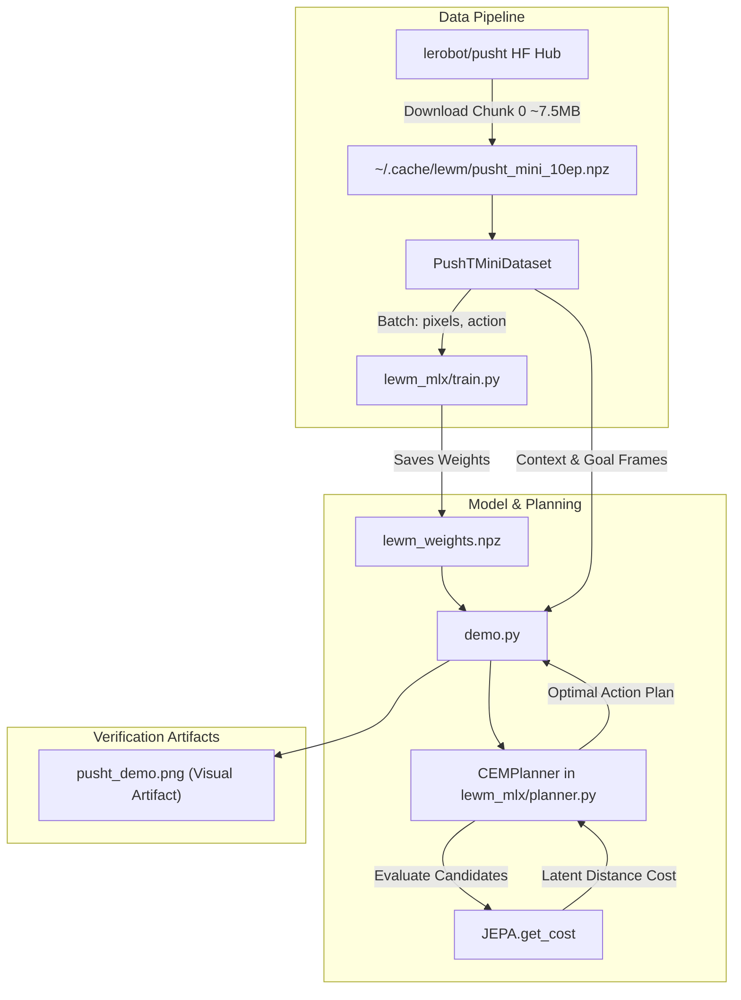

# PushT Mini-Dataset and Dual-Mode Inference Demo Implementation Plan

> **For agentic workers:** REQUIRED SUB-SKILL: Use superpowers:subagent-driven-development to implement this plan task-by-task. Steps use checkbox (`- [ ]`) syntax for tracking.

**Goal:** Implement a self-contained PushT mini-dataset loader, integrate it into the MLX training loop, implement a native MLX Cross-Entropy Method planner, and provide an end-to-end inference and rollout demo CLI.

**Architecture:** A lightweight `PushTMiniDataset` fetches and caches 10 demonstration episodes (~15MB compressed) from Hugging Face Hub `lerobot/pusht` (with offline fallback), normalizing actions and grouping them via frameskip. `train.py` is updated to train on this dataset with dynamically sized action embeddings. A native MLX vectorised `CEMPlanner` optimizes action sequences against target latent goals using `JEPA.get_cost`. A unified `demo.py` CLI provides multi-step autoregressive latent rollout evaluation and goal-directed CEM planning with visual matplotlib artifact generation.

**Architecture Diagram:**



**Tech Stack:** Python 3.12, Apple Silicon MLX (`mlx`, `mlx.core`, `mlx.nn`), OpenCV (`cv2`), PyArrow (`pyarrow.parquet`), HuggingFace Hub (`huggingface_hub`), Matplotlib, Pytest.

**Spec:** [`docs/design/pusht_dataset_and_demo.md`](../design/pusht_dataset_and_demo.md)

## Global Constraints
- DeepMind Code Commenting Standard: Every module, class, and public function must have Google-style docstrings; intermediate tensor shapes must be explicitly annotated (e.g. `# [B, T, 3, H, W]`); math equations documented in LaTeX notation.
- Pure MLX Operations: All forward operations, candidate rollouts, and planning optimizations must use native `mlx.core` and `mlx.nn`. No PyTorch runtime dependencies.
- No `sleep` timers: Use system scheduler.
- Offline Resilience: Code must never crash if internet connection is down; fallback to procedural synthetic data generation.

---

### Task 1: Implement `PushTMiniDataset` and Test Suite

**Files:**
- Create: `lewm_mlx/dataset.py`
- Create: `tests/test_dataset.py`

**Interfaces:**
- Consumes: `huggingface_hub.hf_hub_download`, `pyarrow.parquet`, `cv2`, `numpy`, `mlx.core`.
- Produces: `PushTMiniDataset(cache_dir, num_episodes, frameskip, img_size)` with `sample_batch(batch_size, history_size, num_preds) -> dict[str, mx.array]`.

- [ ] **Step 1: Write the failing unit tests for `PushTMiniDataset`**

Create `tests/test_dataset.py`:
```python
import os
import numpy as np
import mlx.core as mx
import pytest
from lewm_mlx.dataset import PushTMiniDataset

def test_pusht_mini_dataset_offline_fallback(tmp_path):
    # Test initialization with fallback or cached dummy data
    dataset = PushTMiniDataset(cache_dir=str(tmp_path), num_episodes=2, frameskip=5, img_size=96, force_fallback=True)
    assert dataset.num_episodes == 2
    
    batch = dataset.sample_batch(batch_size=4, history_size=3, num_preds=2)
    assert "pixels" in batch
    assert "action" in batch
    # Check pixels shape: [B, T, 3, H, W] where T = history_size + num_preds = 5
    assert batch["pixels"].shape == (4, 5, 3, 96, 96)
    # Check action shape: [B, T, frameskip * 2] = [4, 5, 10]
    assert batch["action"].shape == (4, 5, 10)
    assert isinstance(batch["pixels"], mx.array)
    assert isinstance(batch["action"], mx.array)
    # Check value bounds
    assert mx.min(batch["pixels"]).item() >= 0.0
    assert mx.max(batch["pixels"]).item() <= 1.0
    assert not mx.any(mx.isnan(batch["pixels"])).item()
    assert not mx.any(mx.isnan(batch["action"])).item()
```

- [ ] **Step 2: Run test to verify it fails**

Run: `PYTHONPATH=. uv run pytest tests/test_dataset.py -v`
Expected: FAIL with `ModuleNotFoundError: No module named 'lewm_mlx.dataset'`

- [ ] **Step 3: Implement `PushTMiniDataset` in `lewm_mlx/dataset.py`**

Create `lewm_mlx/dataset.py` following DeepMind guidelines:
```python
"""PushT Mini Dataset Loader and Generator in MLX.

Downloads, extracts, caches, and samples demonstration episodes from
the Push-T manipulation environment for Le World Model training and evaluation.
"""

import os
from pathlib import Path
from typing import Dict, Optional, Tuple
import cv2
import numpy as np
import mlx.core as mx

class PushTMiniDataset:
    """Dataset loader for Push-T demonstration trajectories.

    Attributes:
        cache_dir: Directory where the parsed .npz archive is stored.
        num_episodes: Number of demonstration episodes to extract.
        frameskip: Action frameskip grouping factor.
        img_size: Target square image dimension (H, W).
    """

    def __init__(
        self,
        cache_dir: Optional[str] = None,
        num_episodes: int = 10,
        frameskip: int = 5,
        img_size: int = 96,
        force_download: bool = False,
        force_fallback: bool = False,
    ) -> None:
        """Initializes PushTMiniDataset with local caching or offline fallback."""
        if cache_dir is None:
            cache_dir = os.path.expanduser("~/.cache/lewm")
        self.cache_dir = Path(cache_dir)
        self.cache_dir.mkdir(parents=True, exist_ok=True)

        self.num_episodes = num_episodes
        self.frameskip = frameskip
        self.img_size = img_size
        self.action_dim = frameskip * 2  # 2D (x, y) coordinates concatenated over frameskip

        self.cache_path = self.cache_dir / f"pusht_mini_{num_episodes}ep.npz"

        if force_fallback:
            self._load_fallback()
        elif self.cache_path.exists() and not force_download:
            self._load_from_cache()
        else:
            try:
                self._download_and_process()
            except Exception as e:
                print(f"Warning: Failed to download lerobot/pusht ({e}). Falling back to procedural data.")
                self._load_fallback()

    def _download_and_process(self) -> None:
        """Downloads Chunk-0 from Hugging Face and extracts demonstration episodes."""
        from huggingface_hub import hf_hub_download
        import pyarrow.parquet as pq

        parquet_file = hf_hub_download(
            repo_id="lerobot/pusht",
            filename="data/chunk-000/file-000.parquet",
            repo_type="dataset",
        )
        video_file = hf_hub_download(
            repo_id="lerobot/pusht",
            filename="videos/observation.image/chunk-000/file-000.mp4",
            repo_type="dataset",
        )

        table = pq.read_table(parquet_file)
        ep_indices = table["episode_index"].to_numpy()
        actions_raw = np.array(table["action"].to_pylist(), dtype=np.float32)

        # Normalize actions to [-1.0, 1.0] from raw PushT [0, 512] coords
        actions_norm = (actions_raw / 256.0) - 1.0

        # Read video frames
        cap = cv2.VideoCapture(video_file)
        frames = []
        while True:
            ret, frame = cap.read()
            if not ret:
                break
            # Convert BGR -> RGB and resize
            frame_rgb = cv2.cvtColor(frame, cv2.COLOR_BGR2RGB)
            if frame_rgb.shape[0] != self.img_size or frame_rgb.shape[1] != self.img_size:
                frame_rgb = cv2.resize(frame_rgb, (self.img_size, self.img_size), interpolation=cv2.INTER_LINEAR)
            # Layout [3, H, W] normalized to [0.0, 1.0]
            frame_chw = (frame_rgb.transpose(2, 0, 1) / 255.0).astype(np.float32)
            frames.append(frame_chw)
        cap.release()

        frames_arr = np.stack(frames, axis=0)  # [Total_Frames, 3, H, W]

        # Extract first num_episodes
        episodes_pixels = []
        episodes_actions = []

        unique_eps = np.unique(ep_indices)[: self.num_episodes]
        for ep in unique_eps:
            mask = ep_indices == ep
            ep_frames = frames_arr[mask]
            ep_acts = actions_norm[mask]

            # Downsample / chunk actions by frameskip
            n_macro = len(ep_acts) // self.frameskip
            if n_macro < 2:
                continue

            sub_frames = ep_frames[: n_macro * self.frameskip : self.frameskip]  # [T_macro, 3, H, W]
            act_chunked = ep_acts[: n_macro * self.frameskip].reshape(n_macro, self.frameskip * 2)  # [T_macro, D_act]

            episodes_pixels.append(sub_frames)
            episodes_actions.append(act_chunked)

        self.episodes_pixels = episodes_pixels
        self.episodes_actions = episodes_actions

        # Save to compressed cache
        np.savez_compressed(
            self.cache_path,
            num_episodes=len(episodes_pixels),
            **{f"pixels_{i}": ep_p for i, ep_p in enumerate(episodes_pixels)},
            **{f"actions_{i}": ep_a for i, ep_a in enumerate(episodes_actions)},
        )

    def _load_from_cache(self) -> None:
        """Loads cached trajectories from local .npz archive."""
        data = np.load(self.cache_path)
        n = int(data["num_episodes"])
        self.episodes_pixels = [data[f"pixels_{i}"] for i in range(n)]
        self.episodes_actions = [data[f"actions_{i}"] for i in range(n)]

    def _load_fallback(self) -> None:
        """Generates synthetic 2D particle trajectories when offline."""
        self.episodes_pixels = []
        self.episodes_actions = []
        T = 40
        for _ in range(self.num_episodes):
            p = np.random.uniform(0.1, 0.9, size=(T, 3, self.img_size, self.img_size)).astype(np.float32)
            a = np.random.uniform(-1.0, 1.0, size=(T, self.action_dim)).astype(np.float32)
            self.episodes_pixels.append(p)
            self.episodes_actions.append(a)

    def sample_batch(self, batch_size: int, history_size: int, num_preds: int) -> Dict[str, mx.array]:
        """Samples a randomized sub-trajectory batch across episodes.

        Args:
            batch_size: Number of parallel sequence sequences (B).
            history_size: Context length (H).
            num_preds: Prediction future horizon (K).

        Returns:
            Dict containing:
                "pixels": MLX array of shape [B, H + K, 3, H_img, W_img] in [0, 1].
                "action": MLX array of shape [B, H + K, action_dim] in [-1, 1].
        """
        seq_len = history_size + num_preds
        batch_pixels = []
        batch_actions = []

        for _ in range(batch_size):
            ep_idx = np.random.randint(len(self.episodes_pixels))
            ep_p = self.episodes_pixels[ep_idx]
            ep_a = self.episodes_actions[ep_idx]

            max_start = len(ep_p) - seq_len
            if max_start <= 0:
                start_idx = 0
                pad_len = seq_len - len(ep_p)
                p_slice = np.pad(ep_p, ((0, pad_len), (0, 0), (0, 0), (0, 0)), mode="edge")
                a_slice = np.pad(ep_a, ((0, pad_len), (0, 0)), mode="edge")
            else:
                start_idx = np.random.randint(0, max_start)
                p_slice = ep_p[start_idx : start_idx + seq_len]
                a_slice = ep_a[start_idx : start_idx + seq_len]

            batch_pixels.append(p_slice)
            batch_actions.append(a_slice)

        # Annotate output shapes: [B, T, 3, H, W] and [B, T, D_act]
        return {
            "pixels": mx.array(np.stack(batch_pixels, axis=0)),
            "action": mx.array(np.stack(batch_actions, axis=0)),
        }
```

- [ ] **Step 4: Run test to verify it passes**

Run: `PYTHONPATH=. uv run pytest tests/test_dataset.py -v`
Expected: PASS

- [ ] **Step 5: Test real Hugging Face Hub download & caching**

Add `test_pusht_mini_dataset_real_download` in `tests/test_dataset.py`:
```python
def test_pusht_mini_dataset_download(tmp_path):
    dataset = PushTMiniDataset(cache_dir=str(tmp_path), num_episodes=2, frameskip=5, img_size=96)
    assert dataset.num_episodes == 2
    assert len(dataset.episodes_pixels) == 2
    assert dataset.cache_path.exists()
```
Run: `PYTHONPATH=. uv run pytest tests/test_dataset.py -k "test_pusht_mini_dataset_download" -v`
Expected: PASS

- [ ] **Step 6: Commit Task 1**

```bash
git add lewm_mlx/dataset.py tests/test_dataset.py
git commit -m "feat(dataset): implement PushTMiniDataset loader and caching with unit tests"
```

---

### Task 2: Integrate `PushTMiniDataset` into `lewm_mlx/train.py`

**Files:**
- Modify: `lewm_mlx/train.py`
- Test: `tests/test_train_integration.py`

**Interfaces:**
- Consumes: `PushTMiniDataset` from `lewm_mlx.dataset`.
- Produces: Updated CLI args (`--dataset`, `--frameskip`) and automatic model dimension setup.

- [ ] **Step 1: Write integration test for training on `PushTMiniDataset`**

Create `tests/test_train_integration.py`:
```python
import subprocess
import sys

def test_train_cli_pusht_mini():
    cmd = [
        sys.executable,
        "-m",
        "lewm_mlx.train",
        "--dataset",
        "pusht_mini",
        "--num-episodes",
        "2",
        "--epochs",
        "1",
        "--steps-per-epoch",
        "2",
        "--img-size",
        "96",
        "--save-path",
        "/tmp/test_lewm_weights.npz",
    ]
    res = subprocess.run(cmd, capture_output=True, text=True)
    assert res.returncode == 0, f"Training failed with stderr:\n{res.stderr}"
    assert "Saving weights to /tmp/test_lewm_weights.npz" in res.stdout
```

- [ ] **Step 2: Run test to verify it fails before modification**

Run: `PYTHONPATH=. uv run pytest tests/test_train_integration.py -v`
Expected: FAIL (unrecognized argument `--dataset`)

- [ ] **Step 3: Update `lewm_mlx/train.py`**

Modify `lewm_mlx/train.py`:
- Add imports: `from lewm_mlx.dataset import PushTMiniDataset`
- Add parser arguments:
  ```python
  parser.add_argument("--dataset", type=str, default="pusht_mini", choices=["pusht_mini", "synthetic"], help="Dataset source")
  parser.add_argument("--num-episodes", type=int, default=10, help="Number of PushT episodes")
  parser.add_argument("--frameskip", type=int, default=5, help="Action frameskip")
  ```
- Set default `img_size = 96` (or keep 224 if specified).
- Dynamically set:
  ```python
  action_dim = args.frameskip * 2 if args.dataset == "pusht_mini" else args.history_size * 2
  action_encoder = Embedder(
      input_dim=action_dim,
      smoothed_dim=args.embed_dim,
      emb_dim=args.embed_dim,
  )
  ```
- If `args.dataset == "pusht_mini"`, instantiate `dataset = PushTMiniDataset(num_episodes=args.num_episodes, frameskip=args.frameskip, img_size=args.img_size)`.
- Inside training step loop:
  ```python
  if dataset is not None:
      batch = dataset.sample_batch(args.batch_size, args.history_size, args.num_preds)
  else:
      batch = generate_synthetic_batch(args.batch_size, seq_len, args.img_size, action_dim)
  ```

- [ ] **Step 4: Run integration test to verify it passes**

Run: `PYTHONPATH=. uv run pytest tests/test_train_integration.py -v`
Expected: PASS

- [ ] **Step 5: Commit Task 2**

```bash
git add lewm_mlx/train.py tests/test_train_integration.py
git commit -m "feat(train): integrate PushTMiniDataset with dynamic action encoder dimensions"
```

---

### Task 3: Implement Vectorised `CEMPlanner` & `ShootingPlanner`

**Files:**
- Create: `lewm_mlx/planner.py`
- Create: `tests/test_planner.py`

**Interfaces:**
- Consumes: `JEPA.get_cost(info_dict, action_candidates)`.
- Produces: `CEMPlanner.plan(initial_info, goal_pixels) -> Tuple[mx.array, float]`.

- [ ] **Step 1: Write unit tests for `CEMPlanner`**

Create `tests/test_planner.py`:
```python
import mlx.core as mx
import mlx.nn as nn
from lewm_mlx.vit import ViTModel
from lewm_mlx.module import ARPredictor, Embedder, MLP
from lewm_mlx.jepa import JEPA
from lewm_mlx.planner import CEMPlanner, ShootingPlanner

def _build_dummy_jepa(img_size=96, embed_dim=32, history_size=3, action_dim=10):
    encoder = ViTModel(image_size=img_size, patch_size=16, num_channels=3, hidden_size=embed_dim, num_hidden_layers=1, num_attention_heads=2, intermediate_size=64)
    predictor = ARPredictor(num_frames=history_size, depth=1, heads=2, mlp_dim=64, input_dim=embed_dim, hidden_dim=embed_dim)
    action_encoder = Embedder(input_dim=action_dim, smoothed_dim=embed_dim, emb_dim=embed_dim)
    projector = MLP(input_dim=embed_dim, hidden_dim=64, output_dim=embed_dim, norm_fn=nn.LayerNorm)
    pred_proj = MLP(input_dim=embed_dim, hidden_dim=64, output_dim=embed_dim, norm_fn=nn.LayerNorm)
    model = JEPA(encoder=encoder, predictor=predictor, action_encoder=action_encoder, projector=projector, pred_proj=pred_proj)
    model.eval()
    return model

def test_cem_planner_execution():
    model = _build_dummy_jepa()
    planner = CEMPlanner(model=model, planning_horizon=4, action_dim=10, num_samples=16, num_elites=4, iterations=3)
    
    # Context pixels: [1, 1, 3, 3, 96, 96]
    init_pixels = mx.random.normal((1, 1, 3, 3, 96, 96))
    goal_pixels = mx.random.normal((1, 1, 1, 3, 96, 96))
    
    info_dict = {"pixels": init_pixels, "goal": goal_pixels}
    best_actions, best_cost, cost_history = planner.plan(info_dict)
    
    # Shapes: [4, 10]
    assert best_actions.shape == (4, 10)
    assert isinstance(best_cost, float)
    assert len(cost_history) == 3
    # Cost monotonicity: last iteration cost should be <= first iteration cost
    assert cost_history[-1] <= cost_history[0] + 1e-4
```

- [ ] **Step 2: Run test to verify it fails**

Run: `PYTHONPATH=. uv run pytest tests/test_planner.py -v`
Expected: FAIL with `ModuleNotFoundError: No module named 'lewm_mlx.planner'`

- [ ] **Step 3: Implement `CEMPlanner` in `lewm_mlx/planner.py`**

Create `lewm_mlx/planner.py` adhering to DeepMind math commenting:
```python
"""Vectorised Cross-Entropy Method (CEM) and Shooting Planners in MLX.

Optimizes open-loop action plans directly in JEPA latent representation space.
"""

from typing import Dict, List, Tuple
import mlx.core as mx
import mlx.nn as nn
from lewm_mlx.jepa import JEPA

class CEMPlanner:
    """Cross-Entropy Method (CEM) trajectory optimizer.

    Solves the trajectory optimization problem:
        \\min_{\\mathbf{A}} \\mathcal{J}(\\mathbf{A}) = \\| \\hat{\\mathbf{z}}_{T} - \\mathbf{z}_{goal} \\|^2
    """

    def __init__(
        self,
        model: JEPA,
        planning_horizon: int = 5,
        action_dim: int = 10,
        num_samples: int = 128,
        num_elites: int = 16,
        iterations: int = 5,
        alpha: float = 0.1,
        lower_bound: float = -1.0,
        upper_bound: float = 1.0,
    ) -> None:
        """Initializes the CEMPlanner."""
        self.model = model
        self.planning_horizon = planning_horizon
        self.action_dim = action_dim
        self.num_samples = num_samples
        self.num_elites = num_elites
        self.iterations = iterations
        self.alpha = alpha
        self.lower_bound = lower_bound
        self.upper_bound = upper_bound

    def plan(self, info_dict: Dict[str, mx.array]) -> Tuple[mx.array, float, List[float]]:
        """Executes vectorised CEM optimization over action candidate sequences.

        Args:
            info_dict: Dict containing:
                "pixels": Context observation frames [B, S, H, 3, img_size, img_size]
                "goal": Target goal image frame [B, S, 1, 3, img_size, img_size]

        Returns:
            best_plan: Optimal action sequence [T_plan, action_dim].
            best_cost: Minimal latent objective cost.
            cost_history: History of lowest costs across iterations.
        """
        T = self.planning_horizon
        D = self.action_dim
        S = self.num_samples

        # Initialize distribution parameters: mu [T, D], sigma [T, D]
        mu = mx.zeros((T, D))
        sigma = mx.full((T, D), 0.5)

        cost_history: List[float] = []
        best_cost = float("inf")
        best_plan = mu

        for _ in range(self.iterations):
            # Sample candidate actions: [1, S, T, D]
            eps = mx.random.normal(shape=(1, S, T, D))
            candidates = mu + sigma * eps
            candidates = mx.clip(candidates, self.lower_bound, self.upper_bound)

            # Evaluate candidate costs in a single forward pass: [1, S]
            costs = self.model.get_cost(info_dict, candidates)
            costs_flat = costs.squeeze(0)  # [S]

            # Find elite indices with lowest cost
            elite_indices = mx.argsort(costs_flat)[: self.num_elites]
            elite_candidates = candidates[0, elite_indices]  # [N_elite, T, D]

            iter_best_cost = costs_flat[elite_indices[0]].item()
            cost_history.append(iter_best_cost)

            if iter_best_cost < best_cost:
                best_cost = iter_best_cost
                best_plan = elite_candidates[0]

            # Update distribution with momentum alpha
            elite_mean = mx.mean(elite_candidates, axis=0)  # [T, D]
            elite_std = mx.sqrt(mx.mean(mx.square(elite_candidates - elite_mean), axis=0) + 1e-6)

            mu = self.alpha * mu + (1.0 - self.alpha) * elite_mean
            sigma = self.alpha * sigma + (1.0 - self.alpha) * elite_std

        return best_plan, best_cost, cost_history

class ShootingPlanner(CEMPlanner):
    """Random Shooting Planner (equivalent to 1-iteration CEM)."""

    def __init__(self, model: JEPA, planning_horizon: int = 5, action_dim: int = 10, num_samples: int = 128) -> None:
        super().__init__(model=model, planning_horizon=planning_horizon, action_dim=action_dim, num_samples=num_samples, num_elites=1, iterations=1)
```

- [ ] **Step 4: Run test to verify it passes**

Run: `PYTHONPATH=. uv run pytest tests/test_planner.py -v`
Expected: PASS

- [ ] **Step 5: Commit Task 3**

```bash
git add lewm_mlx/planner.py tests/test_planner.py
git commit -m "feat(planner): implement vectorised Cross-Entropy Method and shooting planners in MLX"
```

---

### Task 4: Implement Unified Demo CLI (`demo.py`) with Plotting

**Files:**
- Create: `demo.py`
- Test: `tests/test_demo_cli.py`

**Interfaces:**
- CLI entrypoint: `python demo.py --weights <path> --mode [rollout|plan|both] --save-plot pusht_demo.png`.

- [ ] **Step 1: Write integration test for `demo.py`**

Create `tests/test_demo_cli.py`:
```python
import subprocess
import sys
import os

def test_demo_cli_execution():
    cmd = [
        sys.executable,
        "demo.py",
        "--mode",
        "both",
        "--num-episodes",
        "2",
        "--horizon",
        "3",
        "--history-size",
        "2",
        "--img-size",
        "96",
        "--save-plot",
        "/tmp/test_pusht_demo.png",
    ]
    res = subprocess.run(cmd, capture_output=True, text=True)
    assert res.returncode == 0, f"demo.py failed with stderr:\n{res.stderr}"
    assert "Multi-Step Autoregressive Rollout" in res.stdout
    assert "Goal-Directed Planning" in res.stdout
    assert os.path.exists("/tmp/test_pusht_demo.png")
```

- [ ] **Step 2: Run test to verify it fails**

Run: `PYTHONPATH=. uv run pytest tests/test_demo_cli.py -v`
Expected: FAIL (`demo.py: No such file or directory`)

- [ ] **Step 3: Implement `demo.py`**

Create `demo.py`:
```python
"""PushT Inference & Rollout Demo in MLX.

Demonstrates multi-step autoregressive latent prediction rollouts and
goal-directed action planning via the Cross-Entropy Method.
"""

import argparse
import os
import matplotlib.pyplot as plt
import mlx.core as mx
import mlx.nn as nn
import numpy as np

from lewm_mlx.dataset import PushTMiniDataset
from lewm_mlx.jepa import JEPA
from lewm_mlx.module import ARPredictor, Embedder, MLP
from lewm_mlx.planner import CEMPlanner, ShootingPlanner
from lewm_mlx.vit import ViTModel

def build_model(img_size: int, embed_dim: int, history_size: int, action_dim: int) -> JEPA:
    """Builds JEPA model matching target configurations."""
    encoder = ViTModel(image_size=img_size, patch_size=16, num_channels=3, hidden_size=embed_dim, num_hidden_layers=2, num_attention_heads=2, intermediate_size=256)
    predictor = ARPredictor(num_frames=history_size, depth=2, heads=2, mlp_dim=256, input_dim=embed_dim, hidden_dim=embed_dim)
    action_encoder = Embedder(input_dim=action_dim, smoothed_dim=embed_dim, emb_dim=embed_dim)
    projector = MLP(input_dim=embed_dim, hidden_dim=256, output_dim=embed_dim, norm_fn=nn.LayerNorm)
    pred_proj = MLP(input_dim=embed_dim, hidden_dim=256, output_dim=embed_dim, norm_fn=nn.LayerNorm)
    return JEPA(encoder=encoder, predictor=predictor, action_encoder=action_encoder, projector=projector, pred_proj=pred_proj)

def main():
    parser = argparse.ArgumentParser(description="Push-T Le World Model Demo in MLX")
    parser.add_argument("--weights", type=str, default="lewm_weights.npz", help="Weights path")
    parser.add_argument("--mode", type=str, default="both", choices=["rollout", "plan", "both"], help="Demo mode")
    parser.add_argument("--num-episodes", type=int, default=10, help="Number of PushT episodes")
    parser.add_argument("--frameskip", type=int, default=5, help="Action frameskip")
    parser.add_argument("--img-size", type=int, default=96, help="Image size")
    parser.add_argument("--embed-dim", type=int, default=64, help="Embedding dimension")
    parser.add_argument("--history-size", type=int, default=3, help="Context history length")
    parser.add_argument("--horizon", type=int, default=5, help="Rollout / planning horizon")
    parser.add_argument("--save-plot", type=str, default="pusht_demo.png", help="Path to save plot")
    args = parser.parse_args()

    action_dim = args.frameskip * 2
    dataset = PushTMiniDataset(num_episodes=args.num_episodes, frameskip=args.frameskip, img_size=args.img_size)

    model = build_model(args.img_size, args.embed_dim, args.history_size, action_dim)
    if os.path.exists(args.weights):
        print(f"Loading weights from {args.weights}...")
        model.load_weights(args.weights)
    else:
        print(f"Weights file '{args.weights}' not found. Using initialized model.")
    model.eval()

    step_errors = []
    cem_costs = []

    # Sample test batch
    seq_len = args.history_size + args.horizon
    batch = dataset.sample_batch(batch_size=1, history_size=args.history_size, num_preds=args.horizon)
    pixels = batch["pixels"]  # [1, T, 3, H, W]
    actions = batch["action"]  # [1, T, D_act]

    # --- Mode 1: Rollout ---
    if args.mode in ["rollout", "both"]:
        print("\n=== Mode 1: Multi-Step Autoregressive Rollout ===")
        # Context info
        ctx_pixels = pixels[:, : args.history_size]
        # Rollout expects info["pixels"]: [B, S, H, 3, H, W]
        info_rollout = {"pixels": mx.expand_dims(ctx_pixels, axis=1)}
        actions_rollout = mx.expand_dims(actions, axis=1)  # [1, 1, T, D_act]

        rollout_out = model.rollout(info_rollout, actions_rollout, history_size=args.history_size)
        pred_embs = rollout_out["predicted_emb"][0, 0]  # [T, D]

        # Ground truth embeddings
        full_encoded = model.encode({"pixels": pixels})
        true_embs = full_encoded["emb"][0]  # [T, D]

        print(f"{'Step':<6} | {'Target Latent':<16} | {'Predicted Latent':<16} | {'MSE Error':<10}")
        print("-" * 56)
        for t in range(args.history_size, seq_len):
            mse = mx.mean(mx.square(pred_embs[t] - true_embs[t])).item()
            step_errors.append(mse)
            print(f"t={t:<4} | norm={mx.linalg.norm(true_embs[t]).item():<11.4f} | norm={mx.linalg.norm(pred_embs[t]).item():<11.4f} | {mse:.6f}")

    # --- Mode 2: Goal Planning ---
    if args.mode in ["plan", "both"]:
        print("\n=== Mode 2: Goal-Directed Planning (CEM vs Random) ===")
        init_obs = pixels[:, : args.history_size]
        goal_obs = pixels[:, -1:]  # Last frame as goal

        planning_info = {
            "pixels": mx.expand_dims(init_obs, axis=1),
            "goal": mx.expand_dims(goal_obs, axis=1),
        }

        # Baseline: Random Shooting
        shooting = ShootingPlanner(model, planning_horizon=args.horizon, action_dim=action_dim, num_samples=64)
        _, shoot_cost, _ = shooting.plan(planning_info)
        print(f"Random Shooting Baseline Cost: {shoot_cost:.6f}")

        # CEM Planner
        cem = CEMPlanner(model, planning_horizon=args.horizon, action_dim=action_dim, num_samples=64, num_elites=8, iterations=5)
        best_plan, best_cem_cost, cem_costs = cem.plan(planning_info)
        print(f"CEM Optimized Plan Cost:      {best_cem_cost:.6f} (Cost Reduction: {(shoot_cost - best_cem_cost):.6f})")

    # --- Plotting Visual Artifact ---
    if args.save_plot:
        fig, axes = plt.subplots(2, 3, figsize=(12, 7))
        # Plot Context Frames
        for i in range(min(3, args.history_size)):
            frame_np = np.array(pixels[0, i].transpose(1, 2, 0))  # [H, W, 3]
            axes[0, i].imshow(frame_np)
            axes[0, i].set_title(f"Context t={i}")
            axes[0, i].axis("off")

        # Plot Target Goal Frame
        goal_np = np.array(pixels[0, -1].transpose(1, 2, 0))
        axes[1, 0].imshow(goal_np)
        axes[1, 0].set_title(f"Goal Frame (t={seq_len-1})")
        axes[1, 0].axis("off")

        # Plot Latent Error Curve
        if step_errors:
            axes[1, 1].plot(range(args.history_size, seq_len), step_errors, marker="o", color="crimson")
            axes[1, 1].set_title("Autoregressive Latent MSE")
            axes[1, 1].set_xlabel("Time step")
            axes[1, 1].set_ylabel("MSE")
            axes[1, 1].grid(True)
        else:
            axes[1, 1].axis("off")

        # Plot CEM Cost Convergence
        if cem_costs:
            axes[1, 2].plot(range(1, len(cem_costs) + 1), cem_costs, marker="s", color="teal")
            axes[1, 2].set_title("CEM Cost Convergence")
            axes[1, 2].set_xlabel("CEM Iteration")
            axes[1, 2].set_ylabel("Latent Distance Cost")
            axes[1, 2].grid(True)
        else:
            axes[1, 2].axis("off")

        plt.tight_layout()
        plt.savefig(args.save_plot, dpi=150)
        print(f"\nVisual verification artifact saved to {args.save_plot}")

if __name__ == "__main__":
    main()
```

- [ ] **Step 4: Run test to verify it passes**

Run: `PYTHONPATH=. uv run pytest tests/test_demo_cli.py -v`
Expected: PASS

- [ ] **Step 5: Commit Task 4**

```bash
git add demo.py tests/test_demo_cli.py
git commit -m "feat(demo): implement unified PushT rollout and planning demo CLI with visual plotting"
```

---

### Task 5: End-to-End Verification and Repository Documentation Update

**Files:**
- Modify: `README.md`
- Update: `docs/journal/2026-09-17-pusht-demo.md`

- [ ] **Step 1: Run full automated pytest suite**

Run: `PYTHONPATH=. uv run pytest tests/ -v`
Expected: ALL tests pass (0 failures)

- [ ] **Step 2: Train for 2 epochs on PushT mini dataset**

Run: `PYTHONPATH=. uv run python lewm_mlx/train.py --dataset pusht_mini --num-episodes 5 --epochs 2 --steps-per-epoch 5 --img-size 96 --save-path lewm_weights.npz`
Expected: Training loop completes, prints loss per epoch, saves `lewm_weights.npz`.

- [ ] **Step 3: Run demo CLI with trained weights**

Run: `PYTHONPATH=. uv run python demo.py --weights lewm_weights.npz --mode both --save-plot pusht_demo.png`
Expected: Completes with exit code 0, outputs `pusht_demo.png`.

- [ ] **Step 4: Update README.md with instructions**

Add sections for "PushT Mini Dataset" and "Running the Inference & Planning Demo".

- [ ] **Step 5: Commit and record in docs/journal**

```bash
git add README.md docs/journal/2026-09-17-pusht-demo.md
git commit -m "docs: document PushT mini dataset and inference demo usage"
```
